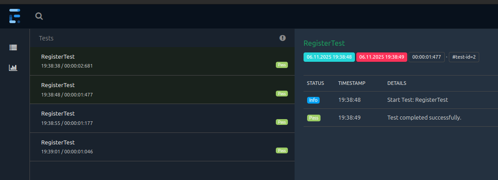

# 🧪 Selenium Demo


A demonstration project for UI test automation using **Selenium WebDriver**, **TestNG**, and **ExtentReports**. The project follows the **Page Object Model** pattern and uses **YAML-based configuration** for flexibility.

---

## 🔧 Technologies Used

- Java 21
- Maven
- Selenium 4.30.0
- TestNG 7.10.2
- WebDriverManager 5.9.2
- ExtentReports 5.1.2
- Log4j 2.24.3
- Lombok 1.18.36
- SnakeYAML 2.2

---

## 🌐 Key Features

- Browser automation using **ChromeDriver** (managed by WebDriverManager)
- Test orchestration with **TestNG**
- HTML test reports generated by **ExtentReports**
- Logging via **Log4j**
- Screenshots automatically taken on test failure
- Modular, maintainable structure using **Page Object Model**
- Configuration-driven via **config.yaml**

---

## 🚀 Running Tests

1. Clone the repository:

   ```bash
   git clone https://github.com/GoralTomaszGorski/selenium-demo.git
   cd selenium-demo
   ```

2. Run tests using Maven:

   ```bash
   mvn clean test
   ```

Tests will run according to the configuration defined in `testng.xml`.

## 📊 Reporting (ExtentReports)

After tests are executed, an HTML report is generated using **ExtentReports**.

### 📁 Report Location:
```
test-output/ExtentReports/ExtentReport.html
```
example:



**# Selenium Demo Project

## Example Test

The project includes basic tests that perform interactions with a sample web page. Here's an example of a simple login test:

   ```bash
public class AddProductTest extends BaseTest {

    @Test(priority = 1)
    public void addProductTest() {
        new HomePage(driver)
                .openShopPage()
                .openProduct("Java Selenium WebDriver")
                .addProductToCart()
                .viewCart()
                .openAddressDetails();
    }

    @Test(priority = 2)
    public void sendBillingDetailsTest() {
        new HomePage(driver)
                .openShopPage()
                .openProduct("BDD Cucumber")
                .addProductToCart()
                .viewCart()
                .openAddressDetails()
                .sendBillingDetails();
    }

    @Test(priority = 3)
    public void checkoutTest() {
        OrderDetailsPage orderDetailsPage = new HomePage(driver)
                .openShopPage()
                .openProduct("Java Selenium WebDriver")
                .addProductToCart()
                .viewCart()
                .openAddressDetails()
                .sendBillingDetails();
        Assert.assertTrue(orderDetailsPage.getOrderNotice().getText().contains("Thank you. Your order has been received."));
    }
   ```
The login test opens the page, enters login credentials, and verifies if the welcome message appears after logging in.


## 📁 Project Structure

```
selenium-demo/
├── src/
│   ├── main/
│   │   └── java/
│   │       └── goral/
│   │           ├── config/       # YAML configuration
│   │           ├── drivers/      # WebDriver initialization
│   │           ├── pages/        # Page Object classes
│   │           ├── reports/      # Report generation logic
│   │           └── utils/        # Helpers, logging
│   └── test/
│       └── java/
│           └── goral/
│               └── tests/        # TestNG test classes
│               └── resources/    # testng.xml, config.yaml
├── test-output/                  # ExtentReports output
└── pom.xml
```

## ⚙️ Configuration

Test configuration is defined in the `config.yaml` file.

Example:
```yaml
url: "https://example.com"
browser: "chrome"
```

## 📌 Future Improvements
- Add API testing (RestAssured or OkHttp)
- Add support for cross-browser testing


---

## 👨‍💻 Author

**Tomasz Górski**

[GitHub](https://github.com/GoralTomaszGorski) | [LinkedIn](https://linkedin.com)
